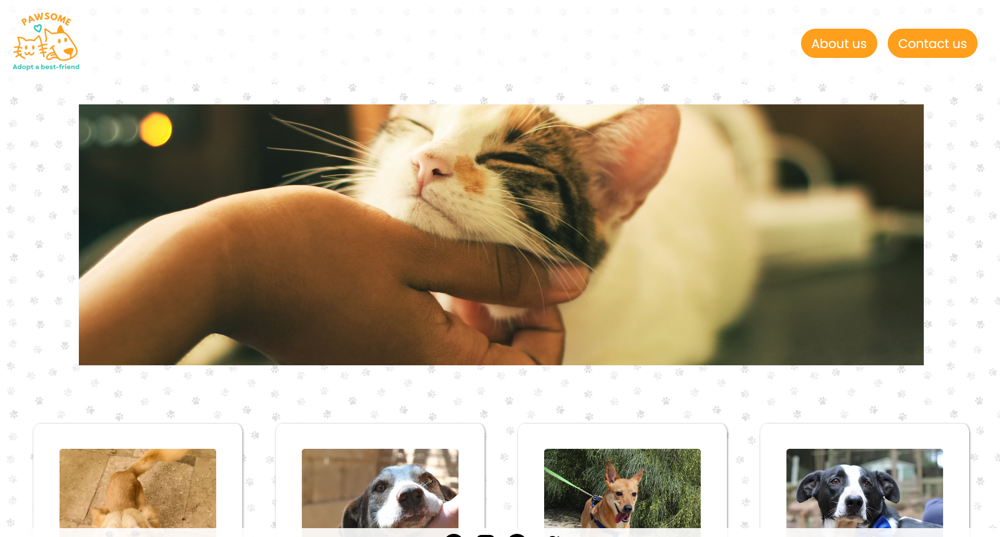
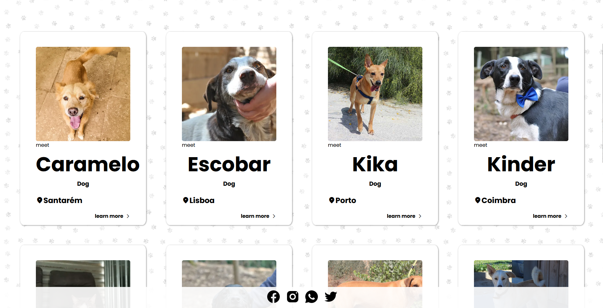
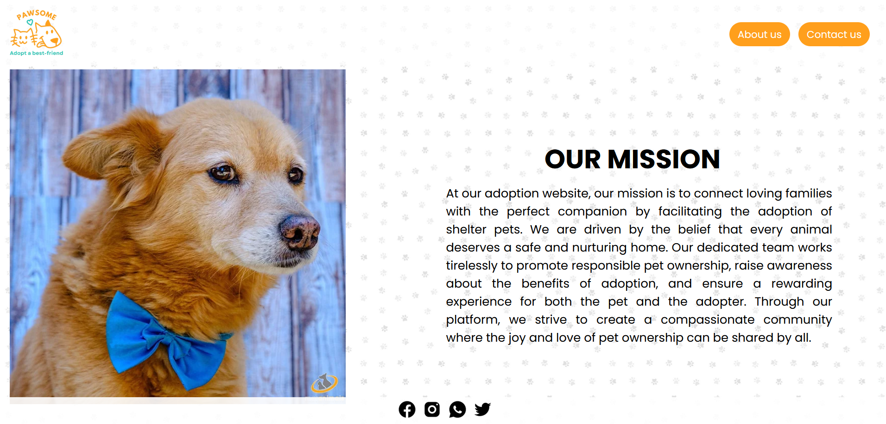
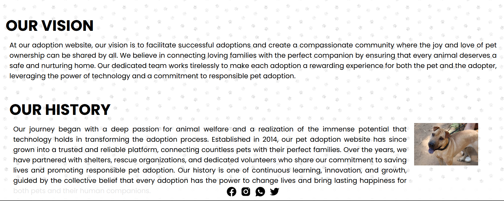
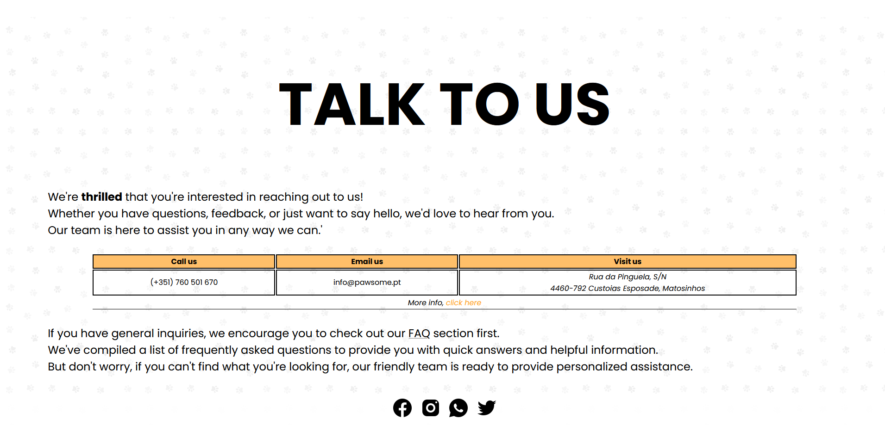
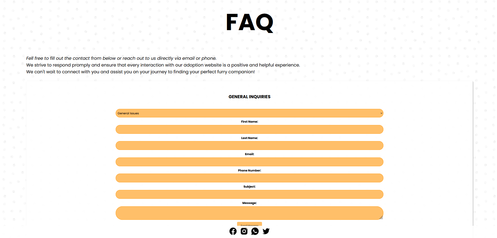

# PAWSOME

Repository to host the project developed for Tecnologias da Internet, a fisrt year subject at Universidade da Maia. Developed by INF-21-TI-G20 Group :

- [@André Gomes](https://github.com/aasfg)
- [@Cátia Antunes](https://github.com/CatiaAntunes)
- [@Gonçalo Sousa](https://github.com/MrcWithAMouth)
- Repository [@inf-22-TI-G20](https://github.com/INF22TIG20/Report_TIM1)

# PAWSOME - Adopt a best friend

We were proposed for the final internet technology project to create a page on the subject of animals. We chose to choose the theme of animal adoption.
Our first screen which is our home page shows us all the animals that are up for adoption, as well as their name and their location, when we click on the animals' names or on "learn more" it will go to another page that will show more detailed information about the animal. Still on the first page we have a header with 3 buttons, one of them is the institution's logo that each time we click there, it will return to the home page, the "About us" button that will go to a page that has a brief description about who we are, what our mission is and our vision as an adoption institution. If we click on "Contact us" which is our third page, it has all the institution's contacts and a form.
We also have our footer that has 4 icons to redirect to our social networks.
Headers and footers are present on all pages.

## Repository organization

- Source code is in the [src folder](src/). Which includes a [js folder](src/js), a [images folder](src/images) and a [css folder](src/css).
- Wireframes is in [User Interfaces](docs/User%20Interface/)

## Technologies

The technologies we used to do this work were:

- XML
- HTML5
- CSS3
- Javascript
- Jquery

### Our main pages

- Home Page (https://inf22tig20.netlify.app/index.html)
- About us (https://inf22tig20.netlify.app/src/pages/nav/about.html)
- Contact us (https://inf22tig20.netlify.app/src/pages/nav/contact.html)

### Frameworks and Libraries

No library was used

### Project presentation

- Chapter 1: [Project presentation](docs/chapter1.md)

### User Interface

- Chapter 2: [User Interface Prototype and Sitemap](docs/chapter2.md)

### Product

- Chapter 3: [Product](docs/chapter3.md)

### Presentation

- Chapter 4: [Presentation](docs/chapter4.md)

## Gallery

|                                                          |                                                          |
| :------------------------------------------------------: | :------------------------------------------------------: |
|  |  |
|                         Homepage                         |                         Homepage                         |

|                                                         |                                                         |
| :-----------------------------------------------------: | :-----------------------------------------------------: |
|  |  |
|                        About Us                         |                        About Us                         |

|                                                           |                                                           |
| :-------------------------------------------------------: | :-------------------------------------------------------: |
|  |  |
|                        Contact us                         |                        Contact us                         |
